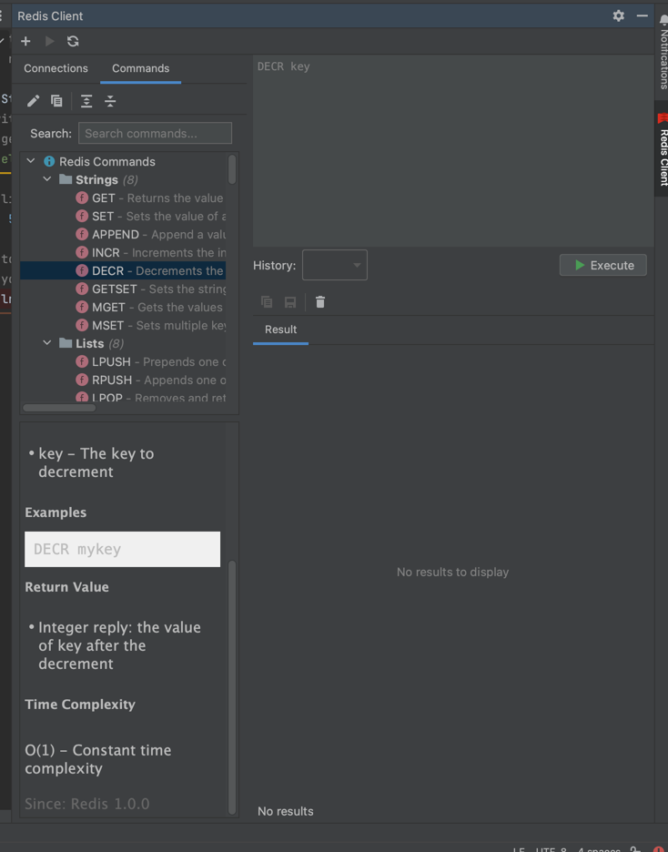

# Redis Client Plugin for IntelliJ IDEA

A comprehensive Redis client plugin for IntelliJ IDEA that allows you to connect to Redis servers, execute commands, browse data, and access full Redis command documentation directly from your IDE.


## Features

- **Redis Connection Management**: Create, edit, save and manage multiple Redis server connections
- **Command Execution**: Run Redis commands with syntax highlighting and command history
- **Console Interface**: Interactive console showing command history with clickable commands for re-execution
- **Data Browser**: View and edit Redis data with specialized formatters for different data types
- **Command Catalog**: Browse the complete Redis command set with documentation
  - Detailed command syntax
  - Parameter descriptions
  - Return value documentation
  - Time complexity information
  - Version information
  - Command examples
- **Command Categories**: Commands organized by data type (Strings, Lists, Hashes, Sets, Sorted Sets, etc.)
- **Command Search**: Quickly find commands by name or description
- **Persistent Command History**: Command history that persists across IDE sessions
- **Copy/Export**: Copy results to clipboard or export to file


## Requirements

- IntelliJ IDEA 2023.1 or later (Community or Ultimate Edition)
- Java 17 or later

## Building from Source

1. Clone the repository:
```bash
git clone https://github.com/yourusername/redis-intellij-plugin.git
cd redis-intellij-plugin
```

2. Build the plugin using Gradle:
```bash
./gradlew clean build
```

3. The built plugin will be available at `build/distributions/redis-intellij-plugin-1.0.0.zip`

## Installation

### From Zip File

1. Download the plugin zip file from the [releases page](https://github.com/yourusername/redis-intellij-plugin/releases) or use the file built from source
2. Open IntelliJ IDEA
3. Go to `Settings/Preferences` → `Plugins`
4. Click the gear icon and select `Install Plugin from Disk...`
5. Navigate to the downloaded zip file and select it
6. Restart IntelliJ IDEA when prompted

### From JetBrains Marketplace

1. Open IntelliJ IDEA
2. Go to `Settings/Preferences` → `Plugins`
3. Click `Marketplace` tab
4. Search for "Redis Client"
5. Click `Install` on the Redis Client plugin
6. Restart IntelliJ IDEA when prompted

## Usage Guide

### Creating a Redis Connection

1. Open the Redis Client tool window (`View` → `Tool Windows` → `Redis Client`)
2. In the Connections tab, click the `+` button to add a new connection
3. Enter your Redis server details:
   - Name: A friendly name for your connection
   - Host: The hostname or IP address
   - Port: The port number (default is 6379)
   - Password: Optional authentication password
   - Database: Database number (default is 0)
4. Click `Test Connection` to verify your settings
5. Click `OK` to save the connection

### Connecting to Redis Server

1. In the Connections tab, select your connection
2. Click the `Connect` button
3. The status indicator will turn green if the connection is successful

### Executing Commands

1. After connecting to a Redis server, use the Command panel to enter Redis commands
2. Type a command (e.g., `SET mykey "Hello World"`)
3. Press `Ctrl+Enter` or click the `Execute` button
4. View the results in the Results panel or Console panel

### Using the Console

The Console panel provides a terminal-like interface showing the history of executed commands and responses:

1. Switch to the Console tab in the results area
2. View the chronological log of commands and their responses
3. **Click on any previous command** to load it back into the command input field for re-execution
4. Commands are displayed with timestamps and clickable formatting
5. Export console history to a file using the toolbar buttons
6. Clear console history when needed

#### Console Features:

- **Clickable Commands**: Click on any `redis>` command line to re-execute it
- **Formatted Responses**: Results are formatted similar to redis-cli output
- **Error Highlighting**: Errors are displayed in red for easy identification
- **Execution Timing**: Shows execution time for each command
- **Persistent History**: Console history is preserved across IDE sessions
- **Export Functionality**: Export console log to text file

### Browsing Commands

1. Open the Commands tab in the left panel
2. Browse through command categories or use the search field to find specific commands
3. Click on a command to view its documentation
4. Double-click to insert the command syntax into the command editor

### Managing Keys

1. In the Connections tab, expand your connection to view databases
2. Select a database to see available keys
3. Right-click on keys to perform operations like View, Edit, Delete, etc.

## Configuration

### Plugin Settings

Access plugin settings at `Settings/Preferences` → `Tools` → `Redis Connections`

Options include:
- Default timeout settings
- Result view preferences
- Command history size
- Automatic reconnection options

### Connection-specific Settings

Each connection can have its own settings:
- SSL/TLS configuration
- Connection timeout
- Authentication options

## Development Setup

### Environment Setup

1. Clone the repository
2. Import the project into IntelliJ IDEA as a Gradle project
3. Make sure you have the "Plugin DevKit" and "Gradle" plugins enabled in IntelliJ IDEA

### Project Structure

- `src/main/java`: Java source files
  - `com.redis.plugin.model`: Data models
  - `com.redis.plugin.service`: Service interfaces and implementations
  - `com.redis.plugin.ui`: UI components
  - `com.redis.plugin.config`: Configuration classes
  - `com.redis.plugin.actions`: Action classes
- `src/main/resources`: Resource files
  - `META-INF/plugin.xml`: Plugin configuration
  - `icons`: Icon resources

### Running the Plugin for Development

To run/debug the plugin in a development instance of IntelliJ IDEA:
```bash
./gradlew runIde
```

### Building the Plugin

```bash
./gradlew buildPlugin
```

## Contributing

We welcome contributions to improve the Redis Client plugin!

### Submitting Bugs/Issues

- Use the GitHub issue tracker to report bugs
- Include detailed steps to reproduce the issue
- Specify your environment (IntelliJ version, OS, Java version)

### Pull Requests

1. Fork the repository
2. Create a feature branch (`git checkout -b feature/amazing-feature`)
3. Commit your changes (`git commit -m 'Add amazing feature'`)
4. Push to the branch (`git push origin feature/amazing-feature`)
5. Open a Pull Request

### Coding Guidelines

- Follow Java coding conventions
- Include proper Javadoc comments
- Write unit tests for new features
- Ensure backward compatibility when possible

## License

This project is licensed under the MIT License - see the LICENSE file for details.

## Acknowledgements

- [Jedis](https://github.com/redis/jedis) - The Redis Java client library used by this plugin
- [Redis](https://redis.io/) - The open source, in-memory data store
- [IntelliJ Platform SDK](https://plugins.jetbrains.com/docs/intellij/welcome.html) - Documentation for IntelliJ plugin development
